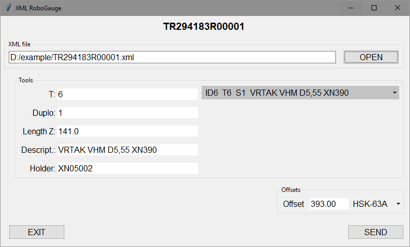

# RoboGauge

The app is used to read set of values from XML file and via GUI interface & serial port sent them into microcontroler driven mechanical device - <b>RoboGauge</b>.

## short introduction

CNC milling machine needs set of tools to do its job, the tools are defined in CAM software. The tools usually consist from two parts:
1. the tool (mill, drill, reamer, tap, etc..), which remove material from workpiece;
2. tool holder, which holds the tool and is inserted into machine spindle;

these two parts mounted together form tool assembly, simply called "tool". 

It is very important to keep correct length (Lm) of assembly when mounting it due to avoid machine collisions and right machining conditions.
The Lm length is defined in CAM software and it is one of values exported and stored in XML file.

The RoboGauge device helps to operator reach correct rough assembly length Lm (+-0.2mm). 
Operator put tool holder into device clamping adapter, insert tool into holder; in app choose the tool from tool set imported from XML and send it's length to device.
The device moves to correct position, operator move the tool against stop gauge and tighten the holder.
Correct tool assembly length is reached without manual measuring. Human mistakes avoided.

Final step is to measure length of tool assembly at profi measuring machine as Haimer, Zoeller, etc. and set final micron precision value into milling machine tool offset table.

## App description

### installation

App consists of these files: 
- `Gauge.py` 
- `Toollist.py` 
- `SenderApp.py` 
    all these `*.py` files ca be substituted by windows executable `RoboGauge_x.y.z.exe` 
- `config.xml`
- `holders_bt40.txt`
- `holders_hsk63.txt`
- `holders_captoc3.txt`

App can be run in python 3.13+ environment. Python modules needed see in file `requirements.txt`. 
or 
can be used windows binary executable `RoboGauge_x.y.z.exe`. 

Make all *.py files executable and run `.\py SenderApp.py`  

### config.xml
the file contains initial settings:
- `<comport>` serial port used
- `<homedir>` home folder, where app starts searching for XML files
- `<pitch>` pitch of RoboGauge's threaded rod [mm]
- `<stp_rev>` steps per revolution of RoboGauge's stepper motor [1/rev]
- `<max_travel>` maximum travel distance of RoboGauge's gauge [mm]
- `<offset_*>` distance from gauge's zero position to each clamping adapter base [mm]

### holders_*.txt

files where id numbers of tool holders are defined. 
Tool holders used with the RoboGauge have basicaly three types of machine-side interface:
- HSK-63A
- BT-40
- Capto C3

Each type of interface must have it's own clamping adapter => 3 different values of offset and 3 different `txt` files where holders are stored. 
App must assign to every holder's ID number extracted from XML correct offset value. 

In each file each ID is typed on 1 line. ID's are stored in separate files to enable user update.

## App usage

1. Run app, hit `OPEN` button and choose XML file in dialog window

  
2. Tool list saved in XML file is loaded. In drop-down menu in 'Tools' section is all tool list available

  
3. Choose desired tool and it's values from drop-down menu

  
4. If necessary, tool adapter type is possile change in drop-down menu in 'Offsets' section. Default adapter is choosen one from XML file

  
5. After all values are set, hit `SEND` button and tool length + current adapter offset are sent to RoboGauge via serial port.

## RoboGauge device

The device is powered by `PICAXE 14M2` chip on `AXEstepper10` board.
It is driven by serial port from RoboGauge app.
It drives `NEMA17` stepper motor with threaded rod.
Gauge slides at two hardened round rods via linear ball bearings.
Initial position of gauge is defined by optic endstop at top side of moving range.
Tool assemby sitting in removable clamping adapter, unique for each type of machine interface.
The adapter is clamped into base desk via `Quick Point` interface.
 
Serial communication protocol consists of 6 bytes:
- the first four bytes is allways mask `"p001"` 
- other two bytes are 2byte value represents number of steps for stepper motor; 
5th byte is lower byte and 6th byte is higher byte of value

Hardware button sends gauge into end position determined by optic endstop.